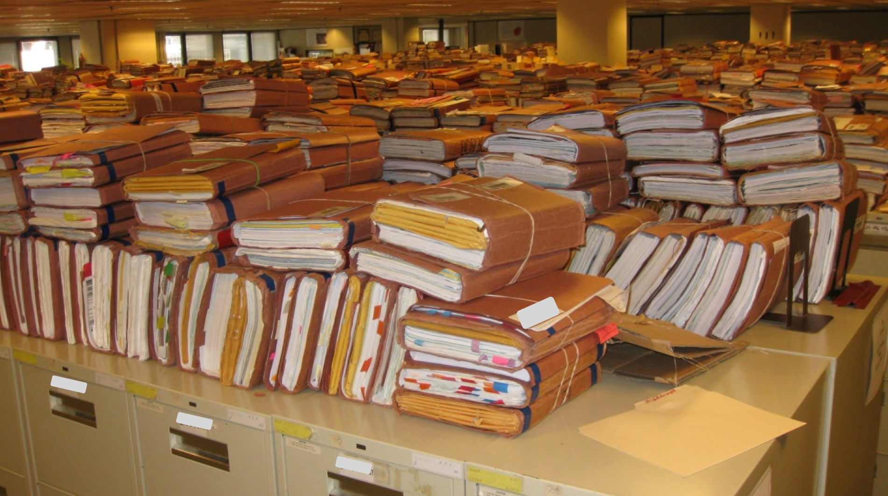

# week 13

We will learn about reading and writing files. This covers chapters 10 and 11 from the book.



## Agenda, Before new content.

 - Homework review - classes (maybe go over step 5 ?)
 - Homework review - forms
 - Homework review - try/catch
 - Homework review - week 8
 - Homework 8: how do you compare dates? What is a unix timestamp? How do you get them?
 - look @ week 4 "notes-on-code.md"
 - Don't capitalize Methods, that is not idiomatic java
 - Don't capitalize package names. This is reverse DNS format.
 - in the forms homework: note about catching exceptions and swallowing exceptions. 
 - in the classes homework, I did not see a lot of null checks. You will get NullPointer Exceptions
 - go around class and see what liking and what is a struggle
 - youtube videos are now up


## Agenda, new content

 - Reading a file in,
 - writing a file out
 - reading + writing at the same time.
 - What is grep?
 - What are we building for the homework assignment?


## Datasets

I have pulled a few datasets from data.gov:

```
https://catalog.data.gov/dataset
```

We will use these to play around with reading files and pulling data out. This is a good place to go if you want to
get large CSV data dumps full of interesting (actually, mostly not so interesting) statistics and raw data.

## Reading files.

## Writing files.

options to write files:

 - CREATE
 - CREATE_NEW
 - DELETE_ON_CLOSE
 - APPEND
 - TRUNCATE_EXISTING
 - WRITE
