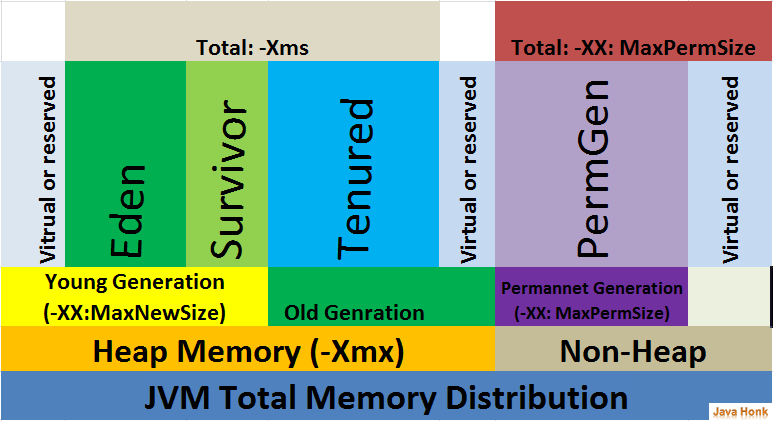

# JVM Memory and Tuning Topics

The JVM has many options around tuning memory usage and the behvior of the garbage collector.


## Microbenchmarking

The JVM uses a Just In Time Compiler (JIT), so you must warm code up before you test it. Java first executes code using an interpreter then decides to compile code when it gets hot. In order to make sure your code is compiled you should consider using this JVM flag:

```
-XX:+PrintCompilation
```


## Youtube Videos:

[Intro to JVM Memory - shows allocating arrays program](https://youtu.be/sdGYda20Y_U)


## Some nice tutorials and blog posts

[Java Heap Space vs Stack](http://www.journaldev.com/4098/java-heap-space-vs-stack-memory)


## Cool diagrams:



## Official Oracle Docs on HotSpot VM:

[Hotspot VM At A Glance](http://www.oracle.com/technetwork/java/javase/tech/index-jsp-136373.html)

[Oracle HotSpot VM options](http://www.oracle.com/technetwork/java/javase/tech/vmoptions-jsp-140102.html)

[General GC Tuning Guide](https://docs.oracle.com/javase/8/docs/technotes/guides/vm/gctuning/)

