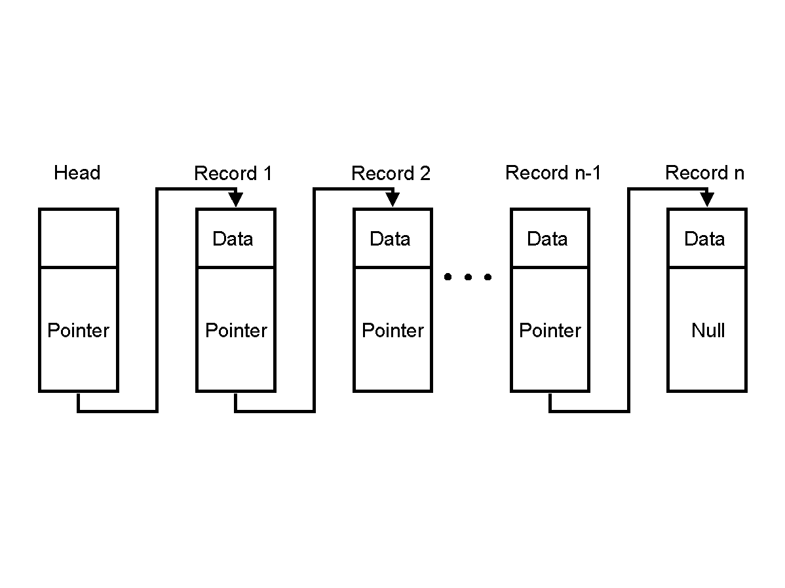
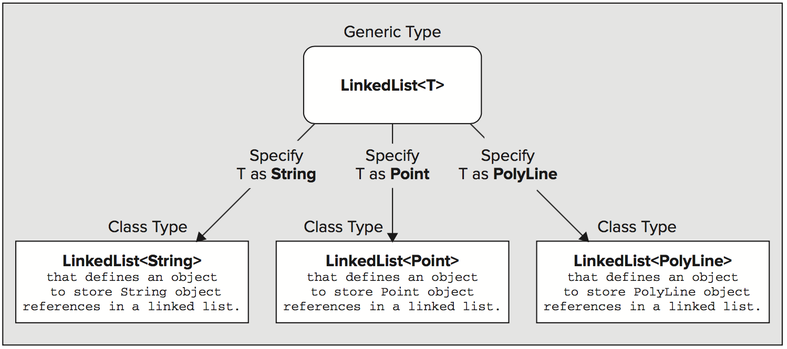
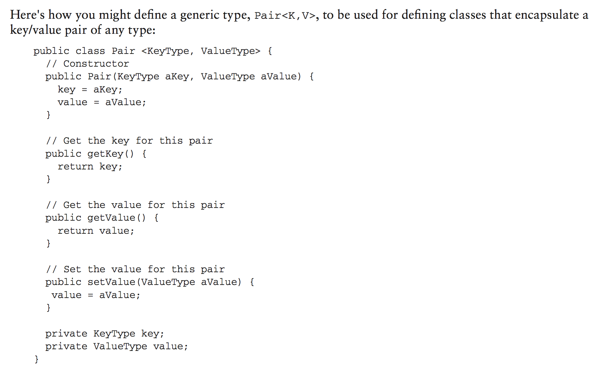
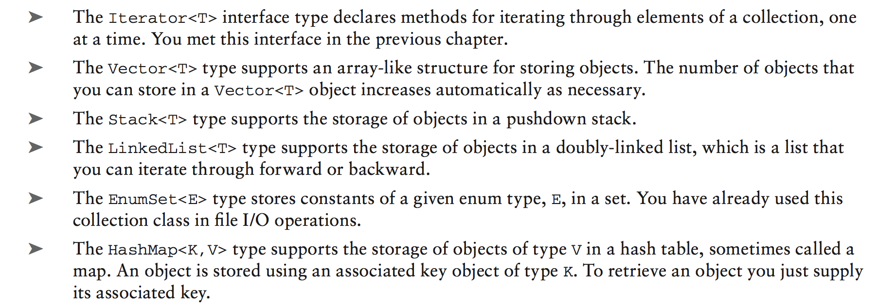
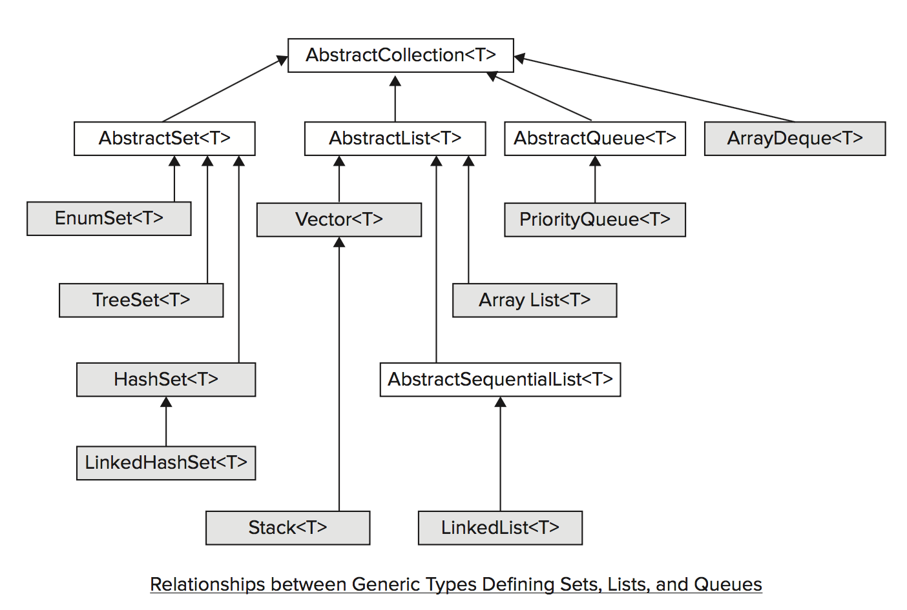

# Week 10: Collections Framework and Generics

This is probably the most important chapter and section of the book to learn and study
in terms of real world use and getting through an interview. Collections are a good
way to start learning about program runtime analysis and efficiency. These topics are
outside of the scope of this class, but they are important computer science topics
and therefore great interview questions.


If you want to get really great at solving these kind of problems go on hackerrank
and work problems. After this chapter you will have everything you need to
start solving (or attempting) the majority of the problems.


## First: You know arrays, now what is a LinkedList ??

This is an array. A contiguous block of memory that you can randomly access (by index position).


Linked list is like an array made of chain links. Each chain link
is connected to the next chain link.




### How are arrays and linked lists similar?

 - __.add()__ element method (array has to resize though, and keep track of the last empty space)
 - __.remove()__ element method
 - __.get()__ element method (linked list has to traverse and count to find it though...)

 So together they have these common methods which you may call a "List" nature. In fact this is how collections work. There are ArrayLists and LinkedLists but they are both lists.


## What is a Generic?

A generic is a placeholder for a class.




### Generic with two placeholders:




## What are Collections?

The collections framework is a group of classes and interfaces that are used to create iterable data structures. The most commonly used collections are Lists, probably followed by Maps.





### Collections are iterable


### Abstract classes of collections




### Interfaces of collections


## List

Lists are like arrays that resize automatically. There are several types of lists but the most commonly used is ArrayList. LinkedList is also commonly used. This is getting into computer science but array list is fast at accessing randomly and linkedlist is fast adding and removing nodes.

```java

// left side   .....    right side
// INTERFACE .......... IMPLEMENTATION

List<String> list = new ArrayList<>();

// underneath, this is an array


// left side   .....    right side
// INTERFACE .......... IMPLEMENTATION

List<String> list2 = new LinkedList<>();

// underneath, this is nodes linked to each other like a chain. Each link in the
// chain points to the next link.


```

## Map (key value stores)

Maps are key-value stores. You can use them to solve many types of problems due to their lookup speed. HashMaps are one of the most common datatypes used in real world programming, and should be studied in depth. They are common interview questions and can actually be used to great benefit in many scenarios.

Very important in solving computer science problems (AKA interview questions)!

For maps to work work correctly, .hashCode and .equals should be implemented.

```java

// left side   .....    right side
// INTERFACE .......... IMPLEMENTATION

Map<String, String> map = new HashMap<>();

// the most commonly used map.


// left side   .....    right side
// INTERFACE .......... IMPLEMENTATION

Map<String, String> map2 = new TreeMap<>();

// keeps keys sorted


// left side   .....    right side
// INTERFACE .......... IMPLEMENTATION

Map<String, String> map3 = new HashTable<>();

// hashtable is threadsafe, all methods are synchronized. This means it is slower
// if you do not need this feature!


```

## Set

A set is like a list where each element is unique. For sets to work correctly, .hashCode and .equals should be implemented.

```java

// left side   .....    right side
// INTERFACE .......... IMPLEMENTATION

Set<String> set = new HashSet<>();

// most commonly used, unordered!


// left side   .....    right side
// INTERFACE .......... IMPLEMENTATION

Set<String> set2 = new LinkedHashSet<>();

// preserves iteration order because it is a linked list underneath.


// left side   .....    right side
// INTERFACE .......... IMPLEMENTATION

Set<String> set2 = new TreeSet<>();

// stores elements sorted in ascending sequence.

```


# Others: Vector, Stack, Queue ...


## Vector

Vector is like a threadsafe ArrayList. See page 529 in the book for an excellent
discussion about how vectors work. It is worth reading that whole section to understand
how the vector works.

  - initially the vector is created with a default (or set by user) length
  - the vector doubles in size when capacity is exceeded
  - this is just like an array that automatically makes itself larger!


## Stack

Stack is a special datastructure that operates last in - first out. Very important
in solving computer science problems (AKA interview questions)!


## Queue

Queue is a special datastructure that operates first in - first out. Very important
in solving computer science problems (AKA interview questions)!


